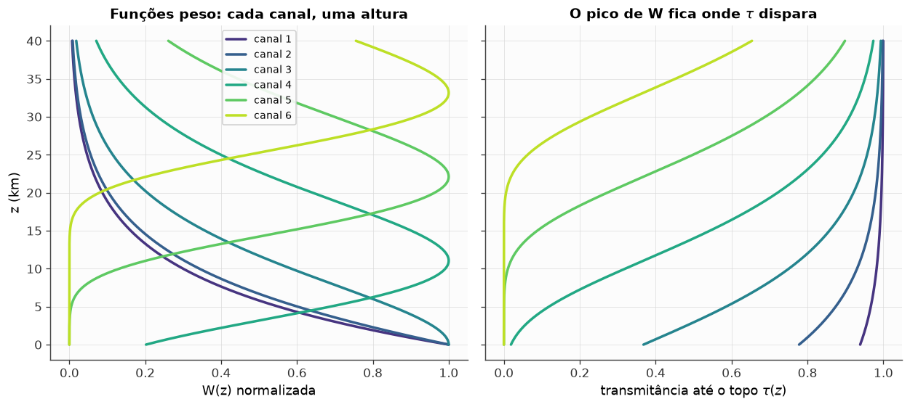
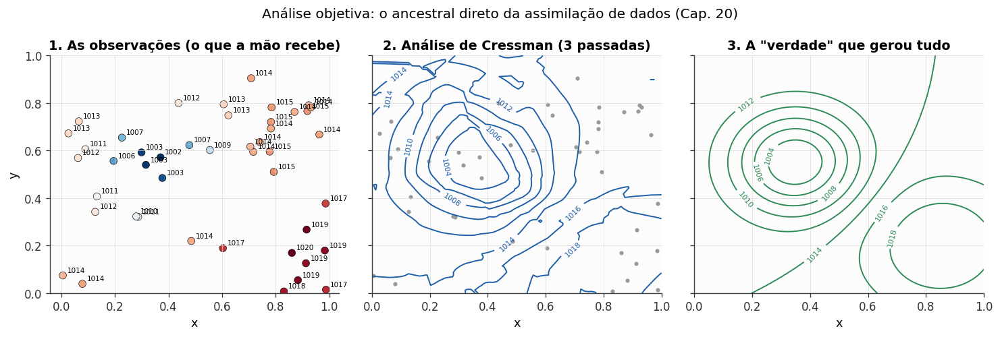
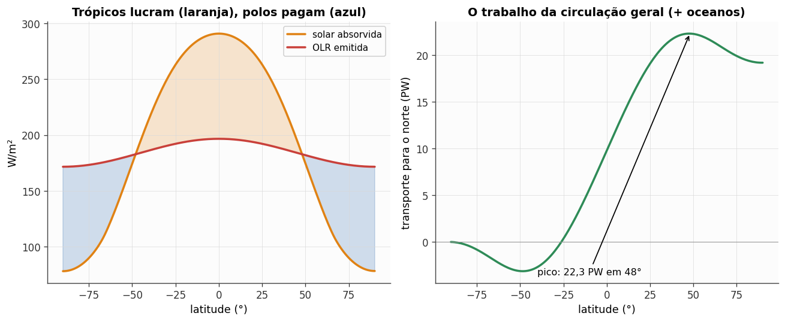
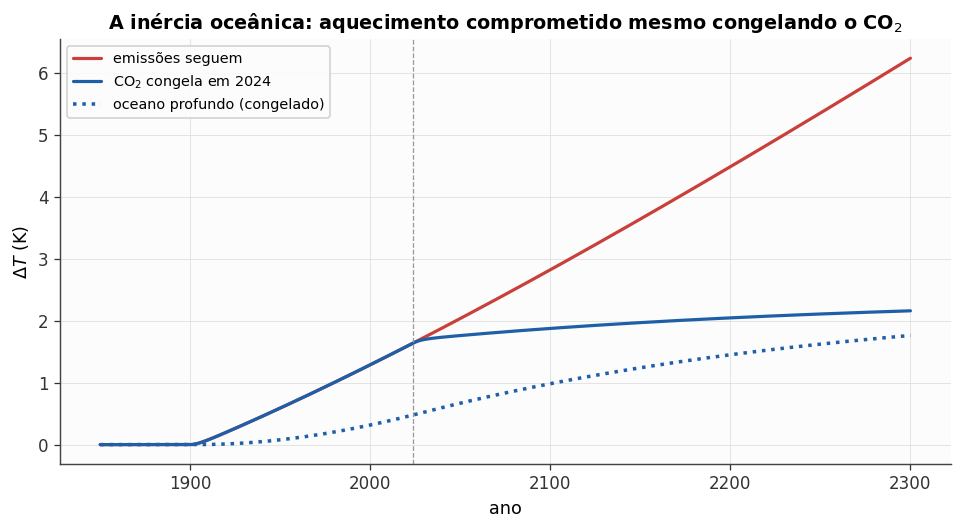
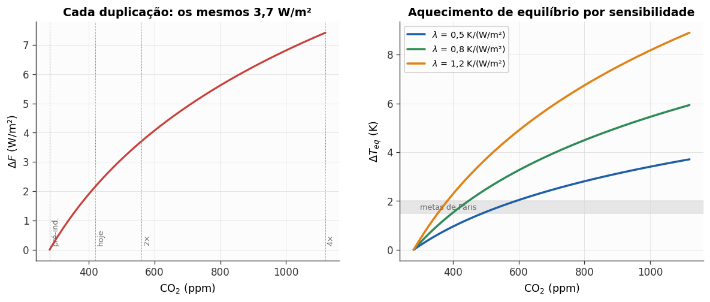
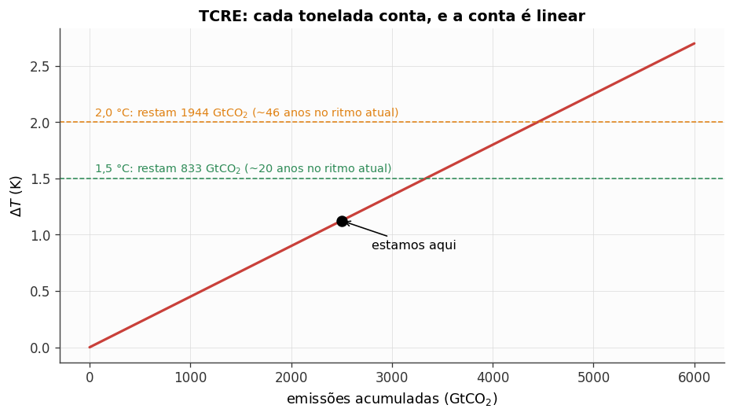

# practical-meteorology-course

[](https://github.com/fabiocampolim-design/practical-meteorology-course/actions/workflows/tests.yml)


Complete **Portuguese (pt-BR)** teaching material for a two-semester
undergraduate course on Roland Stull's open textbook
[*Practical Meteorology: An Algebra-based Survey of Atmospheric Science*](https://www.eoas.ubc.ca/books/Practical_Meteorology/)
(v1.02b, UBC, CC BY-NC-SA 4.0): for each of the book's 22 chapters, plus an
extra module on climate change — **23 chapters** in all — lecture notes,
Beamer slides, a teacher's-guide section, an executed student notebook and a
solutions notebook (**46 notebooks**); printable exercise lists, a
two-semester schedule and a course index. Everything is compiled and executed,
so a teacher needs nothing but a PDF reader to start.

**Em português:** material completo para um curso de graduação em Meteorologia
Prática, em dois semestres, baseado no livro aberto de Stull — notas de aula
(roteiro de quadro), slides Beamer, guia do professor, notebooks do aluno e
de soluções, listas de exercícios e cronograma, para os 22 capítulos do livro
mais um módulo extra sobre mudança climática. **Comece por [`indice.pdf`](indice.pdf).**

<table>
<tr>
<td><a href="notebooks/cap08_sensoriamento.ipynb"></a><br><sub>Ch. 8 — weighting functions: each sounder channel sees one altitude, where its transmittance takes off</sub></td>
<td><a href="notebooks/cap09_cartas.ipynb"></a><br><sub>Ch. 9 — objective analysis: scattered station pressures → a Cressman analysis → the field that generated them</sub></td>
</tr>
<tr>
<td><a href="notebooks/cap11_circulacao.ipynb"></a><br><sub>Ch. 11 — the tropics gain, the poles pay: absorbed solar vs. OLR, and the poleward transport the circulation must do</sub></td>
<td><a href="notebooks/cap23_mudanca.ipynb"></a><br><sub>Module 23 — two-box ocean: warming committed even if CO₂ were frozen today</sub></td>
</tr>
<tr>
<td><a href="notebooks/cap23_mudanca.ipynb"></a><br><sub>Module 23 — every doubling of CO₂ is the same 3.7 W/m²; equilibrium warming for three climate sensitivities</sub></td>
<td><a href="notebooks/cap23_mudanca.ipynb"></a><br><sub>Module 23 — TCRE: warming is linear in cumulative emissions, and the remaining budgets follow</sub></td>
</tr>
</table>

> **Feedback is highly appreciated.** Open an [issue](https://github.com/fabiocampolim-design/practical-meteorology-course/issues)
> for a wrong number in a solution, a slide that does not match the book, a
> notebook that fails in a fresh `meteo` environment, a figure whose credit
> we missed, or a translation that reads badly. Reports from teachers who
> ran a chapter in class are the most useful of all.

## Why this exists

Stull's book is the rare thing: a complete, rigorous, algebra-based
atmospheric-science textbook that is free and openly licensed. What a
lecturer in a Portuguese-speaking department still has to build is
everything around it — a blackboard script per chapter, slides, exercises
with solutions, a schedule that fits two semesters — and the numerical side
the book cannot carry on paper: soundings with MetPy, radiative equilibrium
with climlab, parcel and cloud microphysics with pyrcel and ambiance,
hurricane potential intensity with tcpyPI, radar and satellite data with
Py-ART and Satpy, and small "numerical weather prediction in miniature"
models in every chapter. This repository is that layer, built once, checked
mechanically, and shared under the book's own licence so that anyone can
adapt it.

It was built with an AI coding agent under a strict contract (every
notebook executed and scanned for errors, every figure cited on a slide
verified to exist, every exercise list generated from a single source) and
then reviewed chapter by chapter by the lecturer. The process is documented
below and in [`docs/DEVLOG.md`](docs/DEVLOG.md).

## What is inside

| Chapter | Notes · slides · guide | Student notebook |
|---|---|---|
| 1 Fundamentos da Atmosfera | `cap01_*` | `cap01_fundamentos` |
| 2 Radiação Solar e Infravermelha | `cap02_*` | `cap02_radiacao` |
| 3 Termodinâmica da Atmosfera | `cap03_*` | `cap03_termodinamica` |
| 4 Vapor d'Água | `cap04_*` | `cap04_vapor` |
| 5 Estabilidade Atmosférica | `cap05_*` | `cap05_estabilidade` |
| 6 Nuvens | `cap06_*` | `cap06_nuvens` |
| 7 Processos de Precipitação | `cap07_*` | `cap07_precipitacao` |
| 8 Satélites e Radar | `cap08_*` | `cap08_sensoriamento` |
| 9 Boletins Meteorológicos e Análise de Cartas | `cap09_*` | `cap09_cartas` |
| 10 Forças Atmosféricas e Ventos | `cap10_*` | `cap10_ventos` |
| 11 Circulação Geral | `cap11_*` | `cap11_circulacao` |
| 12 Massas de Ar e Frentes | `cap12_*` | `cap12_frentes` |
| 13 Ciclones Extratropicais | `cap13_*` | `cap13_ciclones` |
| 14 Fundamentos de Tempestades | `cap14_*` | `cap14_tempestades` |
| 15 Perigos de Tempestades | `cap15_*` | `cap15_perigos` |
| 16 Ciclones Tropicais | `cap16_*` | `cap16_furacoes` |
| 17 Ventos Regionais | `cap17_*` | `cap17_ventosregionais` |
| 18 Camada Limite Atmosférica | `cap18_*` | `cap18_camadalimite` |
| 19 Dispersão de Poluentes | `cap19_*` | `cap19_poluentes` |
| 20 Previsão Numérica do Tempo | `cap20_*` | `cap20_previsao` |
| 21 Processos Climáticos Naturais | `cap21_*` | `cap21_clima` |
| 22 Óptica Atmosférica | `cap22_*` | `cap22_optica` |
| 23 Mudança Climática (extra module, not in the book) | `cap23_*` | `cap23_mudanca` |

Each chapter also has `notebooks/capNN_solucoes.ipynb` (teacher only: the
five theory exercises verified with SymPy, the four numerical ones solved).
Across the course: `listas/listas_exercicios.pdf` (one printable list per
chapter), `guia_do_professor/guia.pdf` (47 pages) and `cronograma.pdf`
(semester I: chapters 1–11; semester II: 12–23; 15 weeks each, 2 × 2 h/week,
suggested assessment, and a compact one-semester track), `indice.pdf`.

## Quick start

```
git clone https://github.com/fabiocampolim-design/practical-meteorology-course
cd practical-meteorology-course
# read: indice.pdf, then slides/, notas/, guia_do_professor/
# run the notebooks:
conda env create -f environment.yml && conda activate meteo
jupyter lab notebooks/
# rebuild a deck (TeX Live):
cd slides && pdflatex cap05_slides.tex && pdflatex cap05_slides.tex
```

The [User Manual](docs/USER_MANUAL.md) ([HTML](docs/USER_MANUAL.html),
[PDF](docs/USER_MANUAL.pdf)) covers setup, the teaching workflow, the
maintenance tools and **every feature and every known limitation**.
Working with an AI agent? Hand it [`AGENTS.md`](AGENTS.md).

## Features

Each item is a guarantee the test suite or the course audit enforces:

- **Complete**: 23 chapters × 5 pieces, all compiled and executed; the
  audit fails if a piece, a case or an exercise is missing.
- **Executed, not just written**: all 46 notebooks ship with outputs and
  the suite fails on any error output, any stderr stream, any unexecuted
  code cell, or a notebook over 1.5 MB.
- **Both math forms**: every chapter's notes state the book's algebraic
  form and the differential form side by side.
- **A numerical experiment in every chapter**, framed as a miniature of the
  numerical weather prediction of chapter 20.
- **Single source for exercises**: the printable lists are generated from
  the notes; hand edits are refused by convention and caught by the audit.
- **Figure hygiene**: every book figure on a slide exists and carries the
  CC BY-NC-SA attribution; figures the book credits to third parties are
  not redistributed (a boxed pointer to the book replaces them) and a test
  keeps them out.
- **Read back, not trusted**: the suite opens every committed PDF and
  checks page counts, text and attribution.
- **Tooling with logs**: every maintenance script has a complete
  command-line interface and writes a run log with the command, versions
  and outcome.
- **Static check + suite on three operating systems** in CI (the 21-check
  suite plus a vendored publication-conformance checker).

## Honest comparison with neighbours

- **The book itself** — Stull's site offers the PDF (whole book and per
  chapter) and, for instructors, the book's own exercises. It has no
  slides, no Portuguese material and no executable notebooks; this
  repository adds exactly those and points back to the book for everything
  else. If you teach in English from the book, you may need only the
  notebooks.
- **Unidata's MetPy tutorials and the Python Training gallery** — the
  reference for doing meteorology in Python, in English, organised by
  library feature rather than by course chapter. Our notebooks lean on
  MetPy for soundings and station plots and are organised by Stull's
  chapters instead; when a case needs the canonical MetPy way, the
  notebook says so.
- **climlab, pyrcel, tcpyPI, Py-ART, Satpy documentation** — each has its
  own examples, deeper than any single case here. Use them when a chapter's
  case makes you want more of one tool.
- **Other open meteorology course repositories on GitHub** — mostly English
  lecture notebooks for a single topic (dynamics, radiation, forecasting).
  We found no complete, multi-piece Portuguese course built on an open
  textbook; if you know one, tell us and we will link it.

## Roadmap

- Dates in `cronograma.pdf` once an academic calendar is fixed (validated
  in one real semester: not yet — the material was reviewed chapter by
  chapter by the lecturer in August 2026 but has not run in class).
- Permission requests for the 13 book figures we could not redistribute,
  so the six affected slides can carry the image again.
- Notebook execution in CI in a slim environment (the `meteo` environment is
  too heavy for hosted runners; today the committed outputs are checked).
- English translation of the notes and slides, if there is demand.
- The four deliberate omissions listed in the manual (§5.4, §9.2, §20.5,
  crepuscular rays in ch. 22).

## How it was built

Written with Claude Code (Claude Fable 5) in two sessions, 2026-08-22/23 and
2026-08-26/28: chapter 1 as an approved template, then chapters 2–22 in
batches of three or four, each `.tex` compiled and each notebook executed
and QA-scanned before moving on; chapter 22 rewritten when a slip
(climate change instead of atmospheric optics) was caught, module 23 added
with figures from its own notebook; a scope audit against the book's tables
of contents on 08-28 filled the gaps it found. 58 prompts, about 1 450
assistant turns. Publication (licence split, third-party figure removal,
tooling, tests, CI, this README) in a third session on 2026-09-01/02.

| Role (CRediT) | Fabio Campolim | Claude |
|---|---|---|
| Conceptualization — the course, its shape, the two math forms, the Python stack | ● | ○ |
| Methodology — template chapter, batch workflow, QA-by-JSON rule, exercise scheme | ● | ● |
| Software — notebooks, LaTeX, style module, tools, tests | ○ | ● |
| Validation — executing and scanning every notebook, compiling every document, scope audit | ○ | ● |
| Writing — original draft (notes, slides, guide, exercises, solutions) | ○ | ● |
| Writing — review & editing, chapter-by-chapter approval, corrections | ● | ○ |
| Supervision, project administration, licence and publication decisions | ● | ○ |

● lead ○ support

## Licence

Two licences, by origin — see `NOTICE`:

- **Code** — `ferramentas/`, `comum/*.py`, `comum/*.sty`, `docs/*.py`,
  `tests/`, the code cells of the notebooks:
  [Apache License 2.0](LICENSE). Use, modify and redistribute, commercially
  or not, keeping the licence and notice; contributions under the same terms.
- **Teaching content** — notes, slides, guide, lists, index, figures, the
  text cells of the notebooks: derived from Stull's *Practical Meteorology*
  and therefore, by its ShareAlike clause,
  [CC BY-NC-SA 4.0](LICENSES/CC-BY-NC-SA-4.0.txt) — credit the book and
  this project, **no commercial use**, share adaptations alike. Figures the
  book credits to third parties are not included (see the manual, §7).

### Disclaimer

This material and software are provided **as is**, without warranties or
conditions of any kind, express or implied, including but not limited to
any warranty of merchantability, fitness for a particular purpose, title or
non-infringement. In no event shall the author be liable for any damages of
any character — direct, indirect, special, incidental or consequential — or
for any other claim or liability, whether in contract, tort or otherwise,
arising from, out of or in connection with the material, the software or
their use, even if advised of the possibility of such damages (Apache
License 2.0, sections 7 and 8; CC BY-NC-SA 4.0, section 5). The physics is
checked against the book and by numerical tests, not refereed: you alone are
responsible for what you teach, for the software you install alongside this
project, and for complying with the licences and terms of every book,
package, dataset and service it touches.

This is an independent project. It is not affiliated with, endorsed by or
supported by Roland Stull, the University of British Columbia, Unidata
(MetPy), the climlab, pyrcel, tcpyPI, Py-ART, Satpy or Cartopy projects,
Anthropic, or any institution; their names are used only to identify the
book and the software the material uses.
